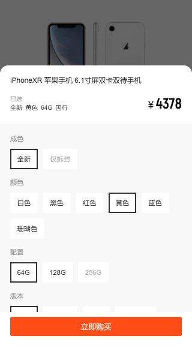

# sku-manage

电商 sku选择组件，相关文章 [两万字长文-电商sku组合查询状态细究与实现](https://juejin.im/post/5d897919f265da03a53a775c)



## Live Demo

[移动端查看效果更佳 Demo](https://accforgit.github.io/sku-manage/index.html)

## Install

```
npm i sku-manager -S
```

## Usage

### 导入

```js
import SkuManage, { joinKVStr, joinAttrStr } from 'sku-manager'
```
`SkuManage`是主类，通过 `new SkuManage`得到实例，`joinKVStr` 与 `joinAttrStr`是辅助分隔符

### 实例

```js
const skuManage = new SkuManage(skuParamVoList, skuRankList)
```
`skuParamVoList`的数据结构：
```ts
interface ISkuParamVoList Array<{
  paramId: string
  paramValue: string
  valueList: Array<{
    valueId: string
    valueValue: string
  }>
}>
```
就是 `sku`的组合结构，例如：
```js
[
  "paramId": "6977",
  "paramValue": "成色",
  "valueList": [{
      "valueId": "1081969",
      "valueValue": "全新"
  }, {
      "valueId": "1080699",
      "valueValue": "仅拆封"
  }]
]
```
`skuRankList`的数据结构：
```ts
interface ISkuRankList Array<{
  spuDId: string
  paramIdJoin: string
  priceRange: Array<string>
  count: number
}>
```
就是一条完整的 `sku`：
```js
"skuRankList": [
    {
      "spuDId": '111111',
      "paramIdJoin": '6977_1081969__6975_730004',
      "priceRange": [6888, 7001],
      "count": 19
    }
]
```

## 计算

当用户切换 `sku`属性时，例如选中了 `颜色_银色`这个属性，那么需要都调用 实例 `skuManage`的 `excuteBySeleted`进行计算，得到当前用户选择状态下的 库存信息、置灰`sku`信息、价格范围等数据：
```js
// 例如，当前选中了 颜色_银色，即 6975_730004，实际场景中，此对象是根据用户选中的 sku属性得到
const activeSkuTagMap = {
  6975: 730004
}
let currentSelectSkuRst = skuManage.excuteBySeleted(activeSkuTagMap)
// 输出选中后计算出来的信息（库存、价格范围，需要置灰的 sku）
console.log(currentSelectSkuRst)
```
`currentSelectSkuRst` 的数据结构：
```ts
interface ICurrentSelectSkuRst {
  currentRst: {
    priceArr: number[]
    spuDIdArr: string[] | number[]
    totalCount: number
  }
  nextEmptyKV: string[]
}
```
`currentRst` 表示当前选中状态下的信息，`priceArr`表示价格范围，例如 `[6899, 9100, 9812]`，`spuDIdArr`表示 `spuDiD`集合（每一条完整的 `sku`组合就是一个 `spu`）,例如 `[1932394, 19123234, 19832345]`， `totalCount` 表示当前选中状态下的总库存，例如 `99`

`nextEmptyKV`表示当前选中状态下需要置灰的 `sku`属性集合，例如 `["6977_1080699"]`

## Example

```js
import SkuManage, { joinKVStr, joinAttrStr } from 'sku-manager'

// mock 数据
const mockData = {
  "skuParamVoList": [{
      "paramId": "6977",
      "paramValue": "成色",
      "valueList": [{
          "valueId": "1081969",
          "valueValue": "全新"
      }, {
          "valueId": "1080699",
          "valueValue": "仅拆封"
      }]
  }, {
      "paramId": "6975",
      "paramValue": "颜色",
      "valueList": [{
          "valueId": "730004",
          "valueValue": "银色"
      }, {
          "valueId": "730005",
          "valueValue": "金色"
      }]
  }],
  "skuRankList": [
    {
      "spuDId": '111111',
      "paramIdJoin": '6977_1081969__6975_730004',
      "priceRange": [6888, 7001],
      "count": 19
    },
    {
      "spuDId": '222222',
      "paramIdJoin": '6977_1081969__6975_730005',
      "priceRange": [6888, 7001],
      "count": 12
    },
    {
      "spuDId": '333333',
      "paramIdJoin": '6977_1080699__6975_730004',
      "priceRange": [6888, 7001],
      "count": 0
    },
    {
      "spuDId": '444444',
      "paramIdJoin": '6977_1080699__6975_730005',
      "priceRange": [6888, 7001],
      "count": 7
    }
  ]
}
// 实例
const skuManage = new SkuManage(mockData.skuParamVoList, mockData.skuRankList)
// 例如，当前选中了 颜色_银色，即 6975_730004，实际场景中，此对象是根据用户选中的 sku属性得到
const activeSkuTagMap = {
  6975: 730004
}
let currentSelectSkuRst = skuManage.excuteBySeleted(activeSkuTagMap)
// 输出选中后计算出来的信息（库存、价格范围，需要置灰的 sku）
console.log(currentSelectSkuRst)
```

更加实际具体的 [例子参见](https://github.com/accforgit/blog-data/tree/master/%E7%94%B5%E5%95%86sku%E7%BB%84%E5%90%88%E7%8A%B6%E6%80%81%E6%9F%A5%E8%AF%A2)